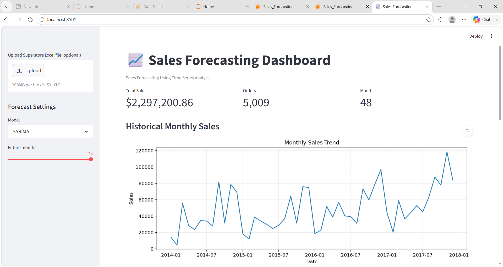
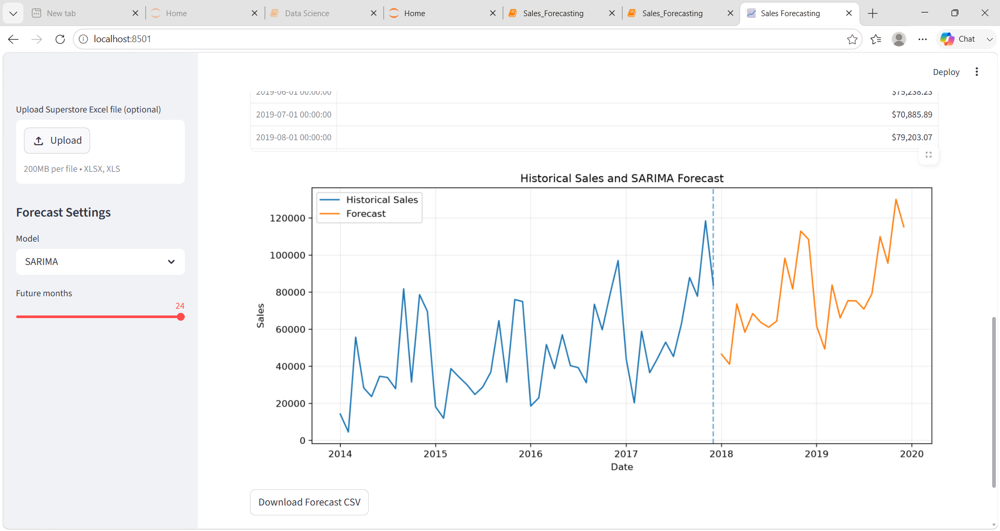

# 📊 Sales Forecasting Using Time Series Analysis
## 🔗 Project Links

- 📂 GitHub Repository: [Sales Forecasting](YOUR_GITHUB_URL)
- 🚀 Live Dashboard: [Streamlit App](https://sales-forecastinggit-3urjst5jqidjeagqfe8fka.streamlit.app/#sales-forecasting-dashboard)

## 📌 Project Overview

This project focuses on forecasting future sales using historical retail sales data.

The project applies Data Science and Time Series Forecasting techniques to understand historical sales patterns, identify trends and seasonality, evaluate forecasting models, and generate future sales predictions.

The project also includes an interactive Streamlit dashboard for visualizing the forecasting results.

---

## 🎯 Project Objectives

The main objectives of this project are:

- Analyze historical retail sales data.
- Perform data cleaning and preprocessing.
- Conduct Exploratory Data Analysis (EDA).
- Identify trends and seasonal patterns in sales.
- Convert transactional sales data into a monthly time series.
- Perform time-series decomposition.
- Test stationarity using the Augmented Dickey-Fuller (ADF) test.
- Analyze Autocorrelation Function (ACF) and Partial Autocorrelation Function (PACF).
- Implement multiple forecasting techniques.
- Compare forecasting models using evaluation metrics.
- Select an appropriate forecasting model.
- Generate future monthly sales forecasts.
- Develop an interactive Streamlit dashboard.

---

## 📂 Dataset

The project uses the **Superstore retail sales dataset** supplied as part of the internship learning material.

### Dataset Features

| Feature | Description |
|---|---|
| Order Date | Date on which the order was placed |
| Sales | Sales amount |
| Category | Product category |
| Region | Geographical region |
| Quantity | Quantity of products ordered |
| Discount | Discount applied |
| Profit | Profit generated |

The primary variables used for forecasting are:

- `Order Date`
- `Sales`

Other variables are used for supporting exploratory data analysis.

---

## 🔄 Project Workflow

The project follows the following workflow:

```text
Raw Sales Data
      ↓
Data Loading
      ↓
Data Cleaning & Preprocessing
      ↓
Exploratory Data Analysis
      ↓
Monthly Sales Aggregation
      ↓
Time Series Visualization
      ↓
Trend & Seasonality Analysis
      ↓
Stationarity Testing
      ↓
ACF / PACF Analysis
      ↓
Train-Test Split
      ↓
Forecasting Models
      ↓
Model Evaluation
      ↓
Best Model Selection
      ↓
Future Sales Forecast
      ↓
Streamlit Dashboard
```

## 🔎 Exploratory Data Analysis

The EDA stage is used to understand the structure and characteristics of the sales data.

The analysis includes:

- Sales distribution
- Sales trends over time
- Monthly sales patterns
- Category-wise sales analysis
- Regional sales analysis
- Quantity and discount analysis
- Profit analysis
- Identification of trends and seasonal behavior

### Visualizations

Visualizations are generated using:

- Matplotlib
- Seaborn
---

## 📈 Time Series Analysis

The transaction-level sales data is transformed into a monthly time series.

This allows the project to analyze:

- Long-term sales trends
- Monthly seasonality
- Recurring sales patterns
- Changes in sales over time

### Time Series Decomposition

The sales series is analyzed using the following components:

```text
Observed
   │
   ├── Trend
   │
   ├── Seasonal
   │
   └── Residual
```

Time-series decomposition helps understand the underlying structure of the sales data.

---

## 🧪 Stationarity Testing

The **Augmented Dickey-Fuller (ADF) test** is used to determine whether the time series is stationary.

Stationarity is important for several statistical forecasting models, particularly ARIMA-based models.

The project analyzes the ADF statistic and p-value to determine whether differencing or other transformations are required.

### Interpretation

Generally:

- **p-value < 0.05** → Evidence of stationarity
- **p-value ≥ 0.05** → Evidence of non-stationarity

---

## 📊 ACF and PACF Analysis

The project uses **ACF** and **PACF** plots to analyze relationships between current and previous observations.

### ACF — Autocorrelation Function

ACF measures the correlation between a time series and its previous observations at different lags.

### PACF — Partial Autocorrelation Function

PACF measures the relationship between observations at different lags after removing the effects of intermediate lags.

ACF and PACF plots help in understanding the appropriate parameters for ARIMA/SARIMA models.

---

## 🤖 Forecasting Models

Multiple forecasting approaches are implemented and compared

### 1. Holt-Winters Exponential Smoothing

Considers:

- Level
- Trend
- Seasonality

This makes it useful for data with recurring seasonal patterns.

### 2. ARIMA

ARIMA stands for:

**AutoRegressive Integrated Moving Average**

It models:

- Autoregression
- Differencing
- Moving Average

### 3. SARIMA

SARIMA extends ARIMA by explicitly modelling seasonal patterns.

It is useful when the sales data contains recurring seasonal behavior.

---

## 📏 Model Evaluation

The forecasting models are evaluated using the following metrics:

### MAE — Mean Absolute Error

Measures the average absolute difference between actual and predicted values.

```text
MAE = Average(|Actual - Predicted|)
```

Lower MAE indicates better performance.

### RMSE — Root Mean Squared Error

Penalizes larger prediction errors more strongly.

```text
RMSE = √(Average((Actual - Predicted)²))
```

Lower RMSE indicates better performance.

### MAPE — Mean Absolute Percentage Error

Measures prediction error as a percentage.

```text
MAPE = Average(|Actual - Predicted| / Actual) × 100
```

Lower MAPE generally indicates better forecasting performance.

---

## 🏆 Model Comparison

The project compares the forecasting models using:

- MAE
- RMSE
- MAPE

The generated comparison results are available in:

```text
outputs/model_comparison.csv
```

The final model is selected based on the actual evaluation results generated by the notebook.

> The numerical results shown in the project are based on the actual execution of the forecasting notebook.

---

## 🔮 Future Sales Forecast

After evaluating the forecasting models, the selected forecasting approach is used to generate future monthly sales predictions.

The generated forecast is available in:

```text
outputs/future_sales_forecast.csv
```

The forecast results can be used to support:

- Sales planning
- Inventory planning
- Business forecasting
- Resource allocation
- Demand planning
- Strategic decision-making

---

## 🖥️ Interactive Streamlit Dashboard

The project includes an interactive Streamlit dashboard for visualizing the sales forecasting results.

The dashboard allows users to visualize:

- Historical sales
- Forecasted sales
- Sales trends
- Forecast results
- Model-related information

The dashboard is implemented using:

**Streamlit**

The main application file is:

```text
app.py
```

### Dashboard Home



### Dashboard Forecast



---

## 📁 Project Structure

```text
sales-forecasting/
│
├── data/
│   └── Superstore.xlsx
│
├── notebooks/
│   └── Sales_Forecasting.ipynb
│
├── outputs/
│   ├── dashboard_forecast.png
│   ├── dashboard_home.png
│   ├── future_sales_forecast.csv
│   └── model_comparison.csv
│
├── app.py
├── requirements.txt
├── README.md
└── .gitignore
```

---

## 🛠️ Technologies Used

### Programming Language

- Python

### Libraries


jupyter
notebook
pandas
numpy
matplotlib
seaborn
scikit-learn
statsmodels
openpyxl
streamlit

### Development Environment

- Jupyter Notebook

### Dashboard

- Streamlit

### Version Control

- GitHub

---

## ⚙️ Installation

Download or clone the repository.

Install the required Python libraries using:

```bash
pip install -r requirements.txt
```

---

## ▶️ Running the Jupyter Notebook

Start Jupyter Notebook using:

```bash
jupyter notebook
```

Open:

```text
notebooks/Sales_Forecasting.ipynb
```

Run the notebook cells from top to bottom.

---

## 🖥️ Running the Streamlit Dashboard

From the project root directory, run:

```bash
streamlit run app.py
```

The Streamlit application will open in your browser.

---

## 📊 Project Outputs

The project generates the following outputs.

### Model Comparison

```text
outputs/model_comparison.csv
```

Contains the evaluation results of the forecasting models.

### Future Sales Forecast

```text
outputs/future_sales_forecast.csv
```

Contains the predicted future monthly sales.

### Dashboard Screenshots

```text
outputs/dashboard_home.png
outputs/dashboard_forecast.png
```

These screenshots demonstrate the forecasting dashboard.

---

## 💡 Key Business Applications

Sales forecasting can help organizations with:

- Inventory management
- Demand planning
- Revenue planning
- Sales target setting
- Business decision-making
- Resource allocation
- Supply-chain planning

---

## 🚀 Future Scope

The project can be further improved by:

- Incorporating external factors such as holidays and promotions.
- Including economic indicators and market trends.
- Performing automated hyperparameter tuning.
- Implementing machine-learning-based forecasting.
- Comparing additional forecasting algorithms.
- Developing real-time forecasting.
- Deploying the Streamlit application online.
- Adding automated model retraining.
- Adding category-wise forecasting.
- Adding region-wise forecasting.
- Integrating the application with a live database.

---

## ✅ Conclusion

This project demonstrates the complete workflow of a Data Science-based sales forecasting solution.

Starting from raw retail sales data, the project performs:

- Data preprocessing
- Exploratory data analysis
- Time-series analysis
- Stationarity testing
- Forecasting model development
- Model evaluation
- Future sales prediction
- Interactive visualization

The addition of an interactive Streamlit dashboard makes the forecasting results easier to visualize and interpret.

The project provides practical experience in applying Python, statistical time-series techniques, forecasting models, model evaluation, and data visualization to a real-world business problem.

---

## 👩‍💻 Author

**Siddhi Tambe**

Data Science Internship Project

**Category:** Sales Forecasting

---

## 📌 Internship Project

This project was developed as part of a **Data Science Internship**.

The repository contains the complete source code, Jupyter Notebook, dataset, forecasting outputs, and interactive dashboard required for project evaluation.

---
